目前我在跟的是datawhale 8月份的组队学习，学的是《科研论文配图绘制指导》

当前的笔记是这本书的第一章，但在我个人看来，这一章实际上放到最后一章是更加合适的，因为这一章的内容比较琐碎，属于很细节的东西，特别适合在论文进行校对，检查时，跟清单一样一项项核对确认。因此，在本笔记中，我也尽量会按照我认为的论文核对逻辑去进行行文，你也可以把此篇打印出来，在提交论文前一项项勾兑

本文所有的库引入放在这里

```
import matplotlib.pyplot as plt
import numpy as np
```

# 图片构成

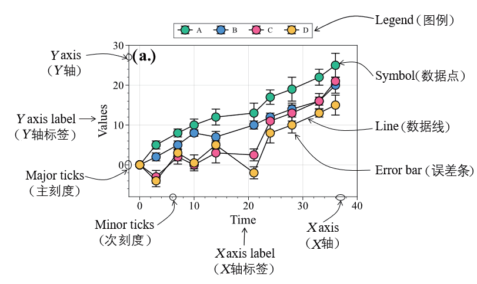

- [ ]  绘图部分（数据点，数据线，误差条，三选其一即可，这是最不可能漏掉的一项）
- [ ] X轴，Y轴
- [ ] X，Y轴的坐标标签
- [ ] 主，次刻度
- [ ] 图例

# 格式和尺寸

- [ ] 矢量图还是像素图
  - [ ] 像素图不能超过300dpi


注：在matplotlib中，我们使用如下方法设置图片dpi

```python
plt.rcParams['savefig.dpi'] = 300
```

# 字号要求

- [ ] 中文：宋体或者黑体
- [ ] 英文：Arial、Helvetica 或Times New Roman 字体

注：

在matplotlib中我们这样设置全局字体（以Times New Roman为例）

```
plt.rc('font',family='Times New Roman', size=15)
```

而在proplot中则更加简单

```
rc["font.family"] = "Times New Roman"
rc["axes.labelsize"] = 15 #设置label上字体的大小
```

# 配色

颜色方面，我们有两种选择，一种选择是使用软件包配好的配色方案（颜色条），一种选择自己是输入颜色。

前者也被叫做颜色主题，而自己手动输入颜色时，我们可以参考色轮进行配色

接下来，我们将以这段代码为例子，让他在按照不同的配色进行绘图

```python
xs = np.random.randn(100)
ys = np.random.randn(100)

#下面的所有代码，都是放在这一行
plt.show()
```

## 颜色条

你可以把颜色条理解成一个直尺，而这个直尺可以通过一个数字来确定他的颜色

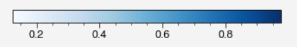

这就意味着我们在画图的时候，需要干两件事：1.确定颜色条（确定这个直尺是哪个） 2. 确定每个点对应的数字（来方便我们进行选颜色）

颜色条分为三种，分别是“单色系”，“双色系“和”多色系“，我们会在接下来的内容中阐述他们各自的用处，使用例子和部分参数（全部参数请自行查阅）。其中前两者是连续的颜色条（就像上图一样），而多色系是离散的颜色条（在多色系中我们在具体聊）

在matplitlib中，我们可以在画图的过程中用cmap这个参数来进行颜色条的设置，而c(color)这个参数来设置每个点对应的颜色，如

```
cmap="bwr"
deg = 1 / (xs ** 2 + ys ** 2 + 1)#这个根据需求自行设置
ax = plt.scatter(xs, ys, c=deg,cmap=cmap)
```

### 单色系

用处（个人观点）：当只有一个变量时，方便观察该变量的变化情况

例子：人口密度图

在ColorBrewer 2.0，我们可以看到使用单色系后的效果（这里用的是绿色）

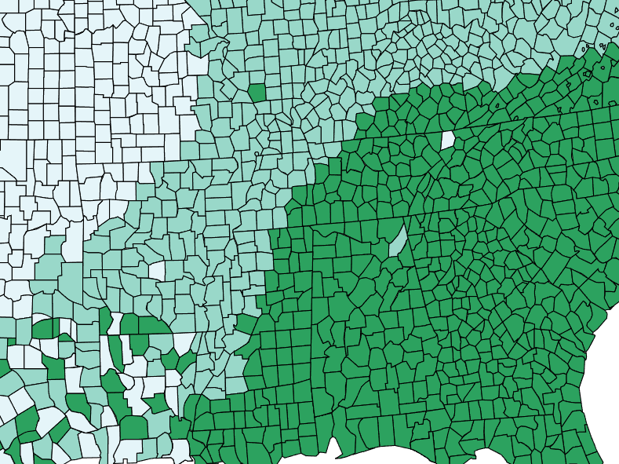

### 双色系

用处：在有一个关键中心值（midpoint）的数值变量中

例子：分类问题

如下图中（图片由之前的代码例子生成，但黑色圈是我用画图工具画上去的，与代码无关），我们可以看到，如果以离原点距离为1作为中心值的话，比1小是红色（也就是黑色圈内部分），比1大就是蓝色。这样在图上就可以很直观的看出他们是如何被分成两类的

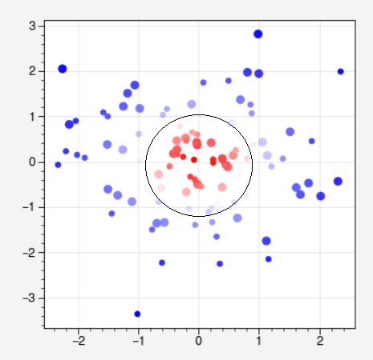

注：你也可以把color和cmap这两个参数合在一起（也就是直接告诉程序选择哪些颜色，而不在颜色调条上选择）

如在上面这幅图的例子中，你可以把代码改成

```
deg = 1 / (xs ** 2 + ys ** 2 + 1)#这个根据需求自行设置
ax = plt.scatter(xs, ys, c=plt.get_cmap('bwr')(deg))
```

### 多色系

用处：数据为类别型数值（类别变量）

例子：条形图

注：

1. 这里我们使用的代码与之前的不同

```
plt.bar(range(5),range(1,6),color=plt.get_cmap('set3')(range(5)))
```

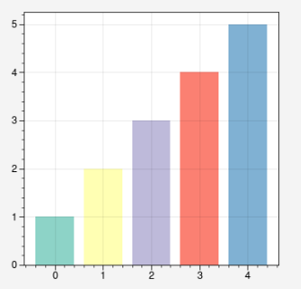

2. 前面提到多色系是离散的，他拥有的颜色是有限个的，这就意味着在一段区间内，不同数字对应的颜色可能是相同的

   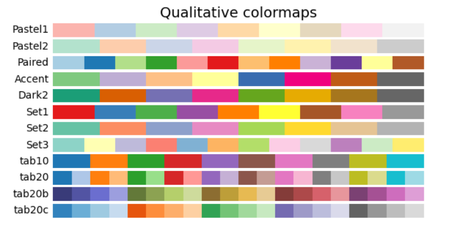

## 色轮配色

我们有如下的几种配色方案，具体颜色选择，可以打开Color Scheme Designer 这个网站，然后根据上面的色轮进行颜色的选择，选择完下方会有个文字"RGB",把后面数字，共6位，复制下来，在前头加一个#，放进代码里面即可，如

```
colors=["#1D1AB2","#C9F600","#FF4C00"]
```

后面的内容我不会写代码，而是着重讲一下这几种配色方案的用途

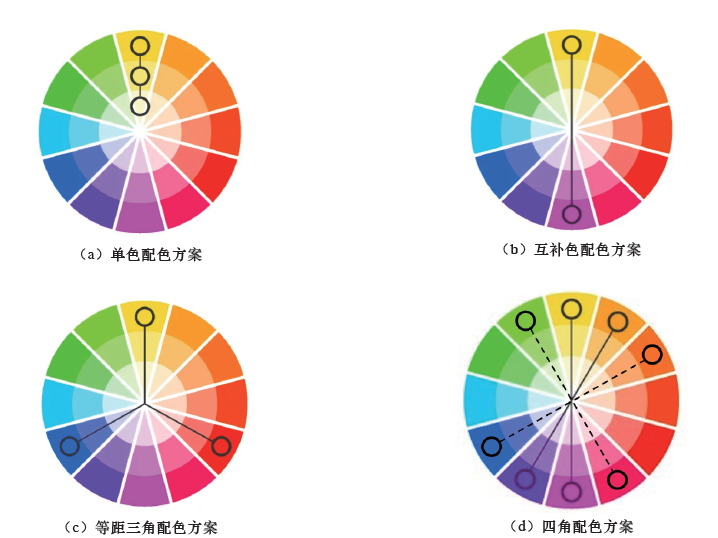

### 单色配色方案

单色配色方案是指将色相相同或相近的一组颜色进行组合。

单色配色方案常被用于表示有直接关系、关系较为密切或同系列的数据。

颜色的选择，其种类不宜过多，3 ～ 5 种较为合适

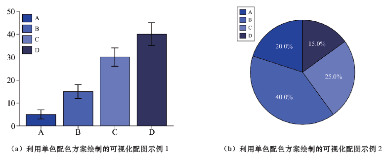

### 互补色配色方案

当只能选择两种颜色时，我们可参考互补色配色方案进行选择。

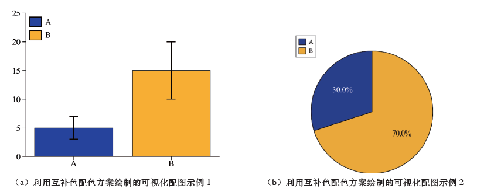

### 等距三角配色方案

等距三角配色方案是指将色轮上彼此间隔120°的3 种颜色进行组合

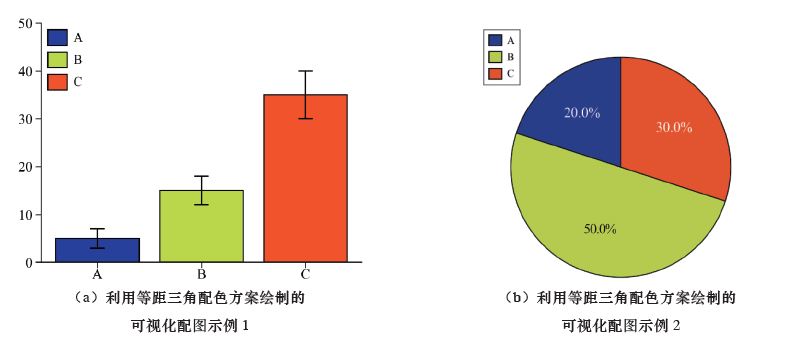

### 四角配色方案

实线表示的两对互补色组成的矩阵配色方案

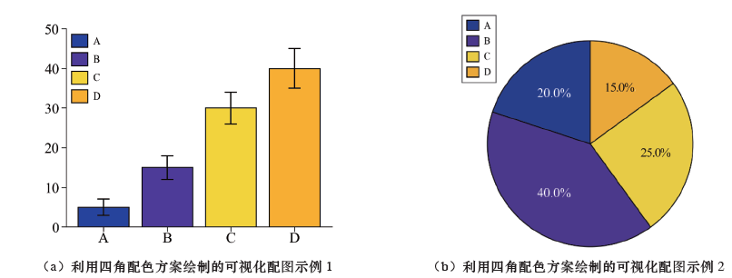


# 一键式：绘图风格

如果你觉得上面的内容都比较繁琐，可以尝试使用绘图风格，代码如下（我们用seaborn）

```
plt.style.use('seaborn')
```

我们可以使用配置好的绘图风格，一下子就可以更改坐标，字体大小等等的所有信息，这样的话也省去设置图片的时间

## scienceplots

这个包可以帮助我们绘制符合一些计算机论文要求的格式，但安装过程比较繁琐

1. 安装scienceplots

```cmd
pip install SciencePlots
```

2. 安装miktex

[Getting MiKTeX](https://miktex.org/download)

记得安装给所有用户(install for all ueseres)

安装完成后请重启一下

3. 在库的导入环节，加入

```python
import scienceplots
```

4.然后你就可以使用science库啦，也就是

```
plt.style.use('science')
plt.style.use(['science','ieee'])#符合ieee要求的论文格式
```

# 版式设计

这一部分是看完绘图本身后，再结合文章的其他部分进行图片的修改

- [ ] 文字的字体要保持一致
- [ ] 字号不大于正文字体的字号，行距、文字间距，应与正文协调一致

- [ ] “先文后图”，

- [ ] 不同尺寸的配图不要安排在同一列或同一行；

- [ ] 避免使用过亮或过暗的颜色

- [ ] 相邻的图层元素不宜采用相近的颜色

- [ ] 对于彩色图，我们要使用原图，慎用灰度图表示。
