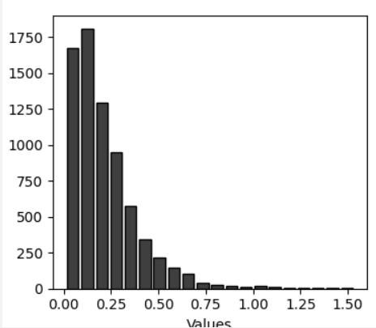
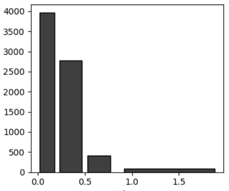
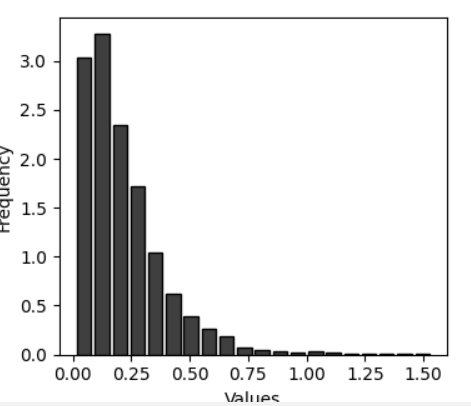
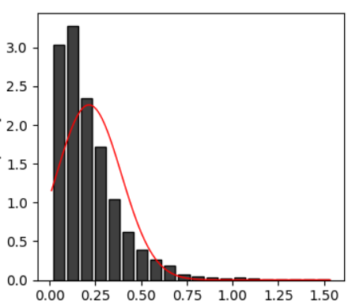
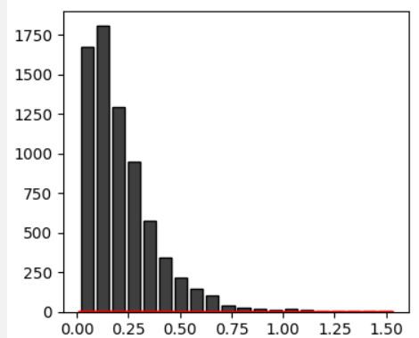
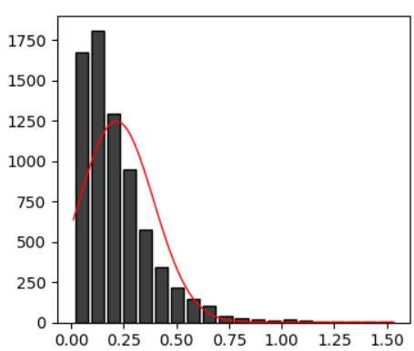

接下来我们进入直方图的讲解

我们直接来看代码

（这里只考虑matplotlib，因为proplot的写法差不太多）

```
hist_data = pd.read_excel(r"柱形图绘制数.xlsx")
hist_x_data = hist_data["hist_data"].values
fig,ax = plt.subplots(figsize=(4,3.5),dpi=100,facecolor="w")
hist=ax.hist(x=hist_x_data,bins=20,color="#3F3F3F",edgecolor ='black',rwidth = 0.8)
```



我们着重于最后一个函数`hist`的这几个参数

`x=`这里是要画图的数据

`bins`在画直方图时，我们需要进行分组，而bins这个参数就是用来设置这个的

1. 如果bins是整数时（如bins=20)，此时python自动帮我们分成等距离的20组）
2. 如果bins是一个数列(如[0,0.2,0.5,0.8,2])，此时会根据[0,0.2),[0.2,0.5),[0.5,0.8),[0.8,2]这四组来进行分类，最后结果为

有的时候我们要的是频率图，我们这样更改代码

```
hist = ax.hist(x=hist_x_data, bins=20,color="#3F3F3F",
          edgecolor ='black',rwidth = 0.8,density=True)
```

此时图是



# 带统计信息的直方图

假设数据是呈正态分布，那么他的正态分布会长啥样呢？

在这种假设情况下，在我们画直方图时也可以加入概率曲线，这个概率曲线就是标题所写的“统计信息”

## 画正态分布

分为几步

1. 获取期望和方差

```
mu,std = norm.fit(hist_x_data)
```

2. 生成x轴上的取样点

```
xmin, xmax = min(hist_x_data),max(hist_x_data)
x = np.linspace(xmin, xmax, 100)
```

3. 生成正态分布

```
p = norm.pdf(x, mu, std)
```

## 密度图

在密度图下，也就是`density=True`

```
ax.plot(x, p,linewidth=1,color="r",label="Normal Distribution Curve")
```




## 频率图

如果`density=False`，我们会画出来



正态分布的图基本上是平的，为什么呢？

因为正态分布的线下方的总面积，是1，换句话说，正态分布线本身是进行过归一化的。而密度图我们也要求所有长方体的面积是等于1。也就是说两者的面积是差不多的。

而频率图是不一样的，直方图的面积明显就大很多。那怎么调整呢，我们来看两个图之间转换的公式（组的宽度指的是这个组的范围大小，如(0.3,0.6)的宽度就是0.6-0.3

> $x_{密度图}=x_{频率图}/总个数/组的宽度$

那换句话说，只要我们把密度图乘以总个数和每个组的宽度)，也就是（

```
N = len(hist_x_data) #总个数
bin_width = (x.max() - x.min()) / bins #组的宽度，假设每个组都等款，bins和画图的用的bins一样，且必须都是整数
ax.plot(x, p*N*bin_width,linewidth=1,color="r",
label="Normal Distribution Curve")
```

