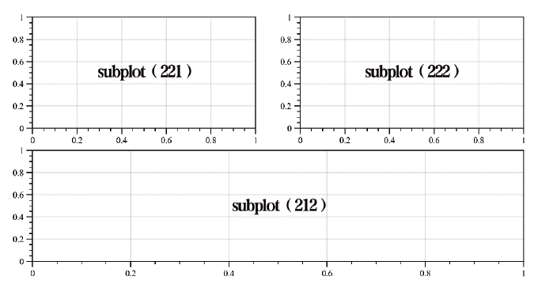
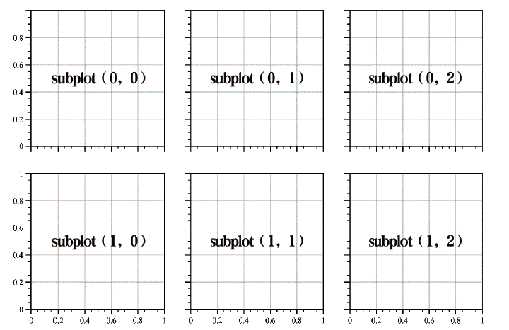
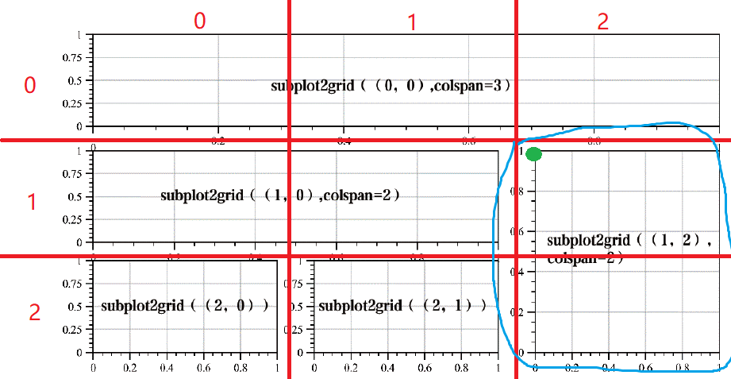
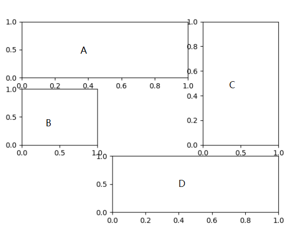
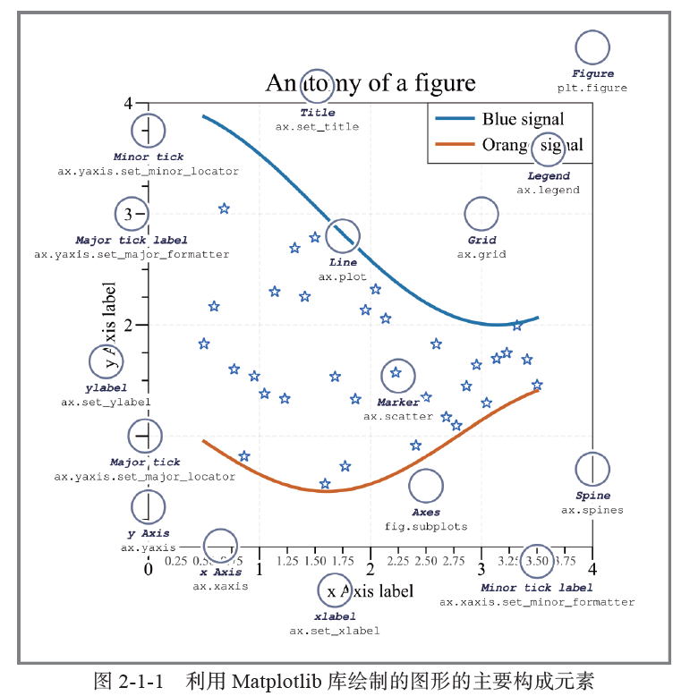

在读书目：《科研论文配图绘制指导》

然后我参考了一下[Matplotlib学习笔记（一）—— figure、axes、pyplot基本概念 - 知乎 (zhihu.com)](https://zhuanlan.zhihu.com/p/583849143)等文章进行相应的参考

# 如何理解matplotlib的绘图方式

以生活中的情况作为例子，假设你现在突然灵感乍现，想要画个对比图（也就是要在图上画两张图），最后把画出来的图片给朋友分享，你会怎么弄呢？

1. 拿出一张**白纸**（画图）和笔
2. 将白纸对折（或者拿铅笔简单的画个线），形成两个区域（**子图**）
3. 在其中的一张子图上，你进行创作，比如画上**横纵坐标**，写上**刻度**，画出一条**折线**，在另一张子图上，也进行类似的创作
4. 最后，将图片给**朋友**分享

那么类似的，在matplotlib我们怎样进行操作呢

1. 创建一个**fig**（画布），相当于拿到了一张白纸，以后的创作将在这张白纸上进行
2. 将这个图纸进行划分，形成多个**子图**（axes)。注：axes是axis的复数，但在matplotlib里面却有着截然不同的用法，axis是轴（属于内容部分），而axes作为子图进行使用
3. 在每个子图上进行**内容**的继续创作
4. 最后，将这个内容**展示**出来

而对应的代码部分则是(这里只是简单给个例子,后面会对每个具体环节的内容进行更精细的展开)

首先是库的导入

```
import matplotlib.pyplot as plt
```

1. 创建画布

```
fig=plt.figure()
```

2. 创建子图

```python
axes=fig.subplots(2,1)
```

3. 内容

```
axes.bar(...)
```

4. 展示

```
plt.show()
```

## 注意（重要）

1. 展示部分和库的导入部分是基本不会变的
2. 上面的的代码，被称为“显示”，也就是要专门要写一行代码，去创建"画布"（fig这个变量）。这个是官方更加推荐的写法，但是也有“隐式”的方法。因为很显然，当你使用matplotlib的时候，你就已经是要打算去绘图，也就是无论如何都是要拿这张白纸的，因此官方也允许你创建一个新的变量，而是直接使用"plt"本身就当做一个变量去进行使用，也就是

```
axes=plt.subplots(2,1)
```

3. 也许你只需要画一个图，而并不需要那么多子图，此时你也可以直接跳过第二步，对整个画布(fig 或者plt)进行操作，如

```
plt.bar(...)
#或者fig.bar(...)
```

# 细节展开

下面的内容主要以隐性使用为主（也就是不直接创建画布这个变量了）

## 创建画布

在创建画布时，我们可以设置画布大小（figsize）、分辨率（dpi）等等，如：

```
plt.figure(figsize=(12,6),dpi=300)
```

其他内容可自行查询

## 创建子图

创建子图的方式有特别多种

注：在子图中，每个子图对应的数字，是从上到下，从左到右计数的

列重要的部分一定要看，但是其他部分可以选择自行跳过

### plt.subplot()/fig.add_plot()(重要)

在图中创建一个子图

```
axes=plt.subplot(a,b,c)
```

如果你要创建一个画布，那么你要这么做(这里是比较少见的，显性和隐性不同的地方)

```
fig=plt.figure()
fig.add_plot(a,b,c)
```

a,b代表你会把这张画布分成a行b列，而c代表你把这个图放的位置对应的数字，可以参考书上的例子

如subplot(222)，意味着把图分成四行四列，然后放在从上到下，从左到右第二个的位子



### subplots()（重要）

跟上面那个函数相比，差别在于函数后面有无复数"s"

而这行代码意味着要画多张图

```
fig, axes = plt.subplots(a, b, sharex=True, sharey=True)
```

注：

1. 这里相当于把创建画布和创建子图放在一起了，当然你也可以吧fig那一部分给删掉，只留下axes，依然也是能跑的
2. 这里意味着把整个画布分成a行b列
3. shareX和sharey分别代表是否共享x轴和y轴的坐标（刻度等）
4. 返回出来的axes是个数组，我们会用调用二维表格的方式来调用他，例如

```
axs[0,0].plot(...)
```



### subplot2grid

```
plt.subplot2grid(shape, location, rowspan/colspan)
```

该函数的第1 个参数shape 规定了的网格的行数和列数，第2 个参数location 决定了子图在网格内的行号和列号（或者可以说是子图的起点），第3 个参数为rowspan 或colspan(也就是向下，或者向下伸展多长)

我以下面这个为例子

```
plt.subplot2grid((3, 3), (1, 2), rowspan=2)
```



我对书上的图进行了修改

1. 整个图被分成了3*3
2. 蓝色圈的这个图，他的起点（绿色点），是(1,2)
3. colspan=2，也就是向下延长2个单位，（这边没说rowspan，默认延长1个单位）

### gridspec.GridSpec()

这个算上面subplot2grid的类似作用，但是他分了两步

```
fig = plt.figure(constrained_layout=True)
gspec = gridspec.GridSpec(ncols=3, nrows=3, figure=fig)
ax1=plt.subplot(gspec[0,:])
```

1. 将图网格化，用gspec这个二维数列去储存
2. 用切片的方式选择这张子图的长宽，如[0,:]，就是把第0行的所有格子，拼起来，然后成为一个新的子图

### subplot_mosaic()

这位更是重量级，先看代码

```
axs_dict = plt.subplot_mosaic(
    """
    AAB
    C.B
    .DD
    """
 )
```

再来看图（图是我自己加的）



可以看到，使用相同字母就意味着这个方格同属于一个子图，此外"."意味着留空

最后的结果返回出来的是一个字典，比如我们想在A上面画图，就可以

```
axs_dict['D'].plot(...)
```

## 内容

我们来看一下一张基本的图包含哪些部分



我们并不能一下子记住所有的上述内容，所有的函数。因此大部分的内容还是建议大家用到的时候现场搜索，更加的方便快捷

下面提几个比较容易被忽视的地方

### 轴

#### 轴比例

这个内容还是挺有用的，特别是一些数据比较大的情况下，我们需要调一下轴的比例，以防止图片太长或者太短

比如你想要让y轴按对数的比例显示

```
axes.yscale("log")
```

#### 刻度位置和刻度格式

比对x轴更改

```
ax.xaxis.set_major_locator(ticker.MaxNLocator(5))
```

其他方式略

此外有个概念要简单说一下——主刻度(major)和次刻度(minor)

仔细看上面那个图，你会发现有的刻度线长，有的刻度线短

长的刻度线之间的距离也比较短，是主刻度，另一个就是此刻度

### 图层

在word中，你会发现，如果你把图片“置于文字上方”，那么图片在移动到文字上面的时候，就会把文字遮住

matplotlib也有分图层，图层更高的内容往往能能够让图层更低的内容无法被显示出来

因此我们有时需要手动调整图层，也即是在画图的时候，在最后更改zorder，例如

```
plt.scatter(x, y,  zorder=2)
```

zorder数字越高，意味着图层越高，也就意味着越不会被覆盖

### 图类型

这个东西更加细致，在这里就不进行展开

后续会对matplotlib里面的每种图都进行说明，包括如何用和如何用在何处

这里有非常多的函数，具体去官网上查找，或者搜索引擎查找，会更加快速一些

## 展示

除了将图显示出来，我们可以把图片进行保存，也就是

```
fig.savefig('result.png', bbox_inches='tight',dpi=300)
```

在此不多做额外的说明