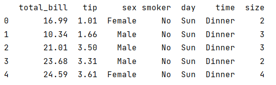
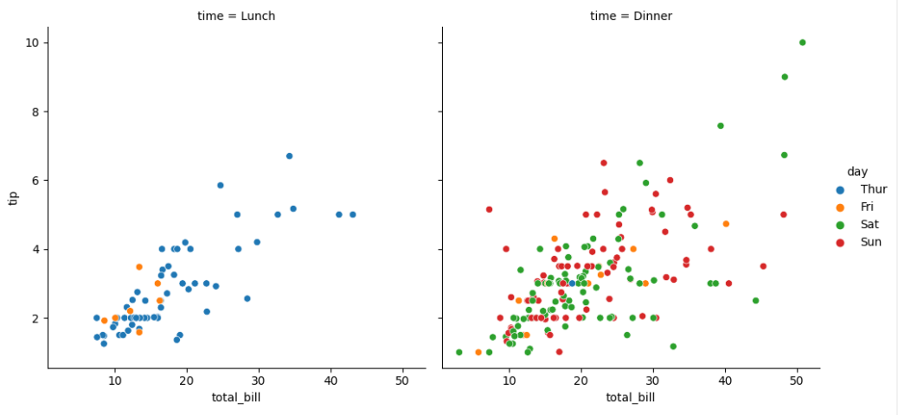
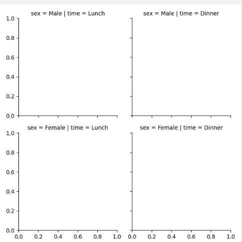
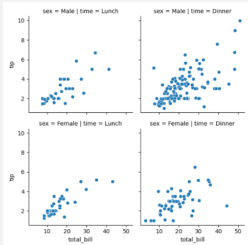
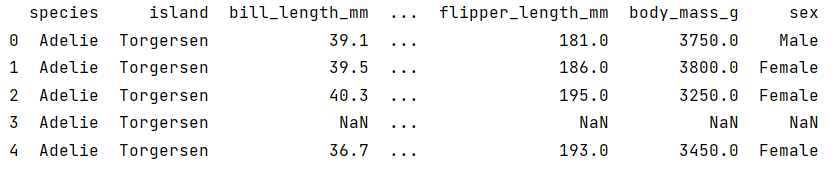
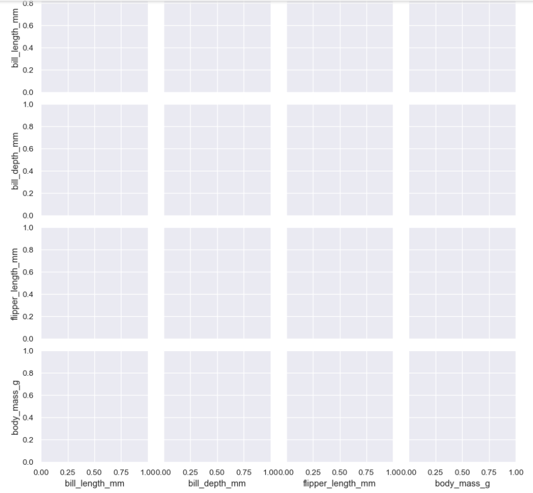
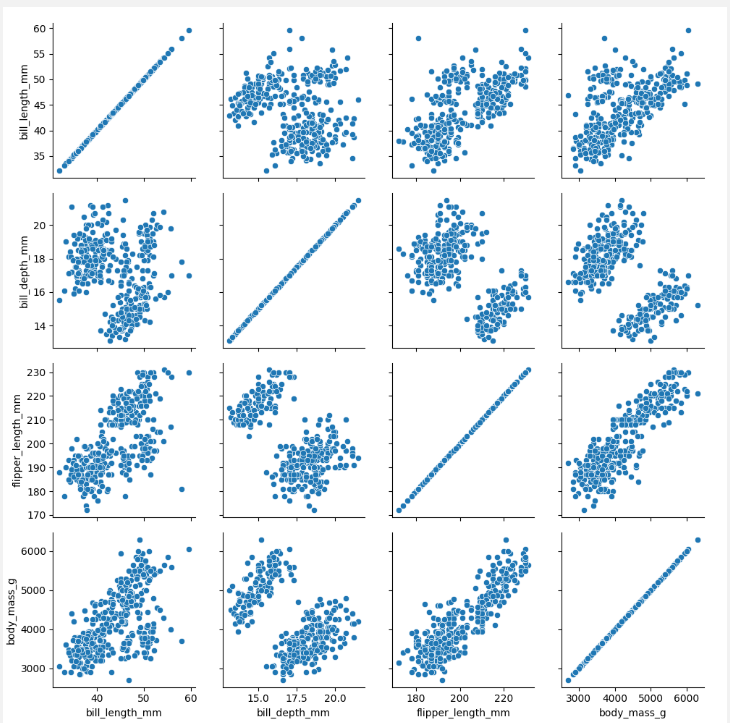
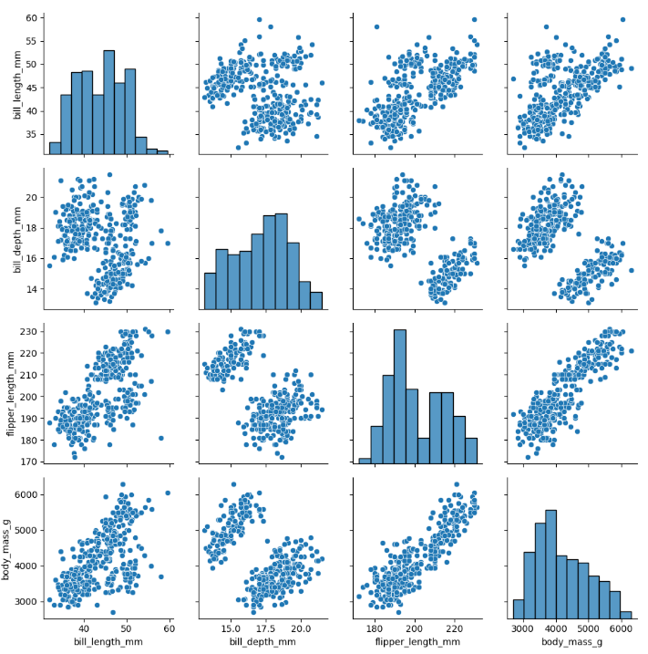
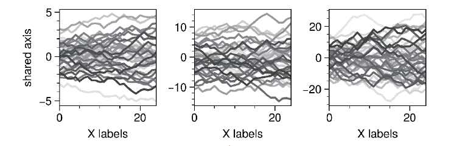
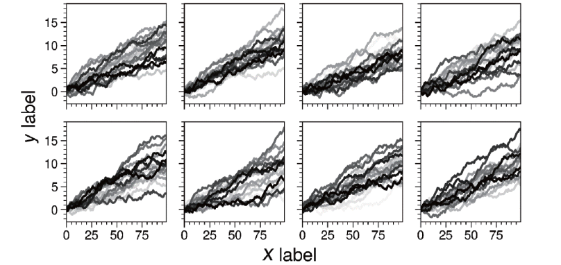

matplotlib是基本上所有python画图的基础。但是matplotlib本身的功能比较简单，要想画一些比较复杂的图，操作起来是比较复杂的。因此，就有更多的客制化的python包，来完成用户形形色色的要求

# seaborn

seaborn算是现如今用的比较多的python封装包，特别是跟数据处理方面

## 优点

1. 可以和pandas读取进来的数据很好的配合
2. 画一些数据处理相关的内容时，很多前置工作seaborn已经帮忙做好了

## 数据加载

```
tips = sns.load_dataset("text.csv")#这段代码和pd.read_csv("text.csv")差不多一样
```


## 好用的画图函数

在seaborn中，有很多matplotlib本身没有的函数，如`kdeplot()`,`ecdfplot()`等等。还是那句话，遇到具体的情况，具体的去搜索相关的函数。这里推荐一个让笔者觉得比较有意思的函数——`relplot`

这个函数的好处在于，他可以按照变量内容的不同，来进行分类画图

我们来看下面这串代码

```
import numpy as np
import seaborn as sns
import matplotlib.pyplot as plt
import pandas as pd
tips = sns.load_dataset("tips")vb #加载数据内置tips的数据
sns.relplot(data=tips, x="total_bill", y="tip", hue="day",col="time") #根据time这个变量来画图
plt.show()
```

我们先来看数据长啥样



当然后面还有，这里没列出来。我们可以看时间(time)的不同来看"total_bill"和"tip"这两个变量的关系

****

## 子图

seaborn的子图是可以直接根据数据有的变量名来生成的，非常

### FacetGrid（）

我们来直接看代码就可以知道了（还是用同一个数据）

```
tips = sns.load_dataset("tips")
g=sns.FacetGrid(tips, col="time", row="sex")
plt.show()
```



我们可以看到，`col=time`意味着每一列的变量"time"都是保持不变的，比如第一行，`time=lunch`，而`row=sex`意味着每一行的变量`sex`是保持不变

我们会发现现在我们只创立了子图，但并没有东西。所以说我们需要把我们的图像给“映射”上去

```
g.map(sns.scatterplot, "total_bill", "tip")
```

第一个`ssns.scatterplot`意味着我们要在图上画散点图

`total_bil`和`tip`分别对应x轴和y轴的数据



### PairGrid()

这次我们换一个数据集说明（数据集长这样）



代码：

```
penguins = sns.load_dataset("penguins")
g = sns.PairGrid(penguins)
```



PairGrid会找出里面的所有的数字型变量，然后进行两两配对

然后在空白的图上加东西



对角线上的变量是一样的，我们不如把他改成直方图

```
g.map_diag(sns.histplot)
g.map_offdiag(sns.scatterplot)
```



## 绘图风格、颜色主题和绘图元素缩放比例

这些内容大概是这样设置的、

```
sns.set_style("style_name") #设置绘图风格
sns.set_palette("palette_name") #设置颜色主题
sns.set_context("context_name") #设置绘图元素缩放比例
```

# proplot

要注意的是，proplot要求matplotlib的版本<3.5，所以建议要使用proplot的时候，请单独建立一个环境，或者像这位大佬一样更改一下环境

[绝不降级！我让Proplot适配高版本Matplotlib(>3.5) - 知乎 (zhihu.com)](https://zhuanlan.zhihu.com/p/651720018)

## 优点

proplot主要的优势在于对格式修改起来比较方便，无论是x轴，还是颜色条，还是字体

## 整体代码格式

整个代码的整体格式为

```
import proplot as pplt
fig=pplt.figure()
axs=fig.subplots()
...
plt.show()
```

当我们想要修改内容的时候，我们会对不同的函数修改里面的参数

### figure()

如果想要更改标签，那我们要修改figure中的参数

1. sharex,sharey:以sharey为例子，这意味着这每一行的纵坐标“共享”一个“标签”



2. spanx,spany：以spanx为例，这意味着“标签”将会横跨多个子图，或者你也可以说，每一行的子图的横坐标是共享的



### axes

如果想要给子图自动的排序，在proplot中可以直接使用`axes.format`来使用，如

```
axs[2, 2].format(abc="(A.)", abcloc="lr") 
```

abc代表文字内容，A或者a代表这个这张图的的编码要放的位置，字符串的其他内容代表格式，在这个代码中，这里代表我在图片上第9张画（3*3的子图），也就是从a,b,c,..数到第九个，也就是I（如果这里是a，意味着是小写的i），于是这里图上标注的结果时"(I.)"

而abcloc意味着标签在什么位置，如"lr"意味着右下角

## 颜色条

proplot可以让子图的颜色条不会出现干扰，使用方法为

```
ax.colorbar(...)
```

## 更美观颜色和字体

matplotlib里面自带的颜色和字体也比较少，而proplot也在改进这一问题

颜色的修改（改为batlow，这个matplotlib没有）：

```
m = ax.heatmap(state.rand(10, 10), cmap='batlow')
```

更改字体（这也是python里面没有的）

```
rc["font.family"] = "TeX Gyre Cursor"
```
