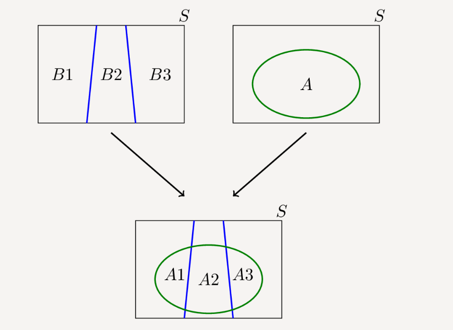

# 样本空间

样本空间$\Omega$(sample space)：所有可能结果的集合

事件(event)：样本空间的一个子集

## 例子

我们想知道掷一个公平的骰子，并观察结果，那么此时的样本空间为

$S = \{1,2,3,4,5,6\}$

那么对于结果为偶数的事件，就是$E=\{2,4,6\}$

# 概率

## 朴素定义

看一个事件发生的可能性大小

例如，对于一个公平的筛子，

他投出结果为偶数的概率是0.5，因为投出奇数和偶数的可能性是一样的

也就是当$E=\{2,4,6\}$,P(E)=0.5

他投出结果小于0的概率是是0,因为不可能投出小于0的数

此时$E=\{0\}$P(E)=0

## 公理性定义

对于函数P来说，如果他满足一下性质，那么他就是概率函数

*   **公理1：** 对于任何事件 A，其概率 $P(A) \geq 0$。
*   **公理2：** 样本空间 S 的概率为 \(P(S) = 1\)。
*   **公理3：** 若 $(A_1, A_2, A_3, \dots )$ 为互斥事件，则
    $P(A_1 \cup A_2 \cup A_3 \dots) = P(A_1) + P(A_2) + P(A_3) + \dots $

## 例子

在投筛子的例子中，我们可以定义概率为

$P(E)=\frac{|E|}{|S|}$，这里的$|·|$代表集合元素的个数

可以轻松检验出他满足上述三个公理

# 离散概率

考虑一个样本空间 $S$。如果 $S$ 是一个**可数**集，这指的是一个**离散概率模型**。在这种情况下，由于 $S$ 是可数的，我们可以列出 $S$ 中的所有元素：

$$
S = \{s_1, s_2, s_3, \dots\}.
$$

如果 $A \subset S$ 是一个事件，那么 $A$ 也是可数的，并且根据概率的第三条公理，我们可以写出：

$$
P(A) = P\left(\bigcup_{s_j \in A} \{s_j\}\right) = \sum_{s_j \in A} P(s_j).
$$

## **等可能有限样本空间**

如果样本空间有限，也就是$|S|<\infty$

且等可能，也就是$ P(s_i) = P(s_j) \text{ for all } i, j \in \{1, 2, \dots, N\}. $

此时，我们就会发现

$P(\{s_i\})=\frac1N,P(A)=\frac{|A|}{|S|}$

# 条件概率

如果 A 和 B 是样本空间 S 中的两个事件，那么 A 在 B 发生条件下的**条件概率**定义为

当P(B)>0时，$ P(A|B) = \frac{P(A \cap B)}{P(B)}$

## 例子

我掷一个公平的骰子。设 A 为掷出奇数的事件，即 \(A = \{1, 3, 5\}\)。再设 B 为掷出小于或等于 3 的事件，即 \(B = \{1, 2, 3\}\)。在 B 发生的情况下，A 的概率 \(P(A|B)\) 是多少？

以朴素的观点来看，在已知筛子的数字是1,2,3的前提下，这时投掷出奇数的概率为$P(A|B)=\frac23$

而以条件概率的定义来看，$A\cap B=\{1,3\}$

$P(A|B)== \frac{P(A \cap B)}{P(B)}=\frac 23$

## 条件概率也是概率

可以被证明，在固定B的前提下，$P(·|B)$也是条件概率

# 独立

如果一个事件不提供关于另一个事件的任何信息，那么这两个事件是独立的。

比如A是明天下雨，B是扔硬币是正面，那么是否知道硬币是正面，对明天是否下雨的概率并无影响

## 定义

两个事件 A 和 B 是独立的，当且仅当 $P(A|B)=P(A)$

也就是$P(A \cap B) = P(A|B)P(B)=P(A)P(B)$。

## 性质

如果 A 和 B 是独立的，那么
* A 和 $B^c$ 是独立的，
* $A^c$ 和 B 是独立的，
* $A^c$ 和 $B^c$ 是独立的。

# 全概率公式

全概率定律：
如果 $B_1, B_2, B_3, \dots$是样本空间 \(S\) 的互斥子集，那么对于任何事件 A，我们有
$P(A) = \sum_i P(A \cap B_i) = \sum_i P(A|B_i)P(B_i).$

该公式描述了**由因推果**的计算方式

## 例子

如果把$B_i$看成是事件发生的原因（比如$B_1$是天空变黑，$B_2$是天空晴朗）

A看成事件发生的结果（比如是否下雨）

$P(A|B_i)$就是已知天空颜色，下雨的概率

那么全概率公式就是把所有可能的原因列出来，然后在不同的原因下，观察结果发生的可能性，最后得出发生该结果的总可能性（也就是没有任何信息的前提下）

# 贝叶斯公式

*   对于任意两个事件 A 和 B，其中 \(P(A) \neq 0\)，我们有
    $P(B|A) = \frac{P(A|B)P(B)}{P(A)}.$
*   如果 \(B_1, B_2, B_3, \dots\) 构成样本空间 \(S\) 的一个划分，并且 A 是任何一个满足 \($P(A) \neq 0$\) 的事件，我们有
    $ P(B_j|A) = \frac{P(A|B_j)P(B_j)}{\sum_i P(A|B_i)P(B_i)}.$

该公式描述了由果推因的描述方式

## 例子

比如事件A是发烧，事件B是得流感

那么$P(A|B)$也就是已知流感，病人发烧的概率（由因得果）

但实际生活中，我们能观察到的是病人的发烧，而我们也更关心病人发烧时得流感的概率，也就是$P(B|A)$，方便对症下药（已知结果求原因）

通过贝叶斯公式就可以计算出已知结果背后原因的概率

# 条件独立

如果给定一个事件 C 且 \(P(C) > 0\)，那么两个事件 A 和 B 是**条件独立**的，如果
$P(A \cap B|C) = P(A|C)P(B|C) \quad$

也就是$P(A|B, C) = P(A|C)$

一般来说，条件独立既不意味着（也不被）独立所暗示。因此，我们可能会有两个事件是条件独立的，但它们并非无条件独立。同样，我们也可以有两个事件是独立的，但给定事件 C 后，它们却不是条件独立的。

# 组合

## 乘法原理

假设我们进行 r次实验，使得第 k次实验有$n_k$ 种可能的结果，其中 k = $1, 2, \dots$, r。那么这 r次实验的序列总共有 $n_1 \times n_2 \times n_3 \times \dots \times n_r$ 种可能的结果。

## 术语

*   **抽样 (Sampling)**：从一个集合中抽样意味着从该集合中选择一个元素。我们通常从给定集合中随机**抽取**样本，其中集合中的每个元素都有相同的被选择机会。

*   **有放回或无放回 (With or without replacement)**：通常我们从一个集合中抽取多个样本。如果我们每次抽取后都将对象放回，我们称之为**有放回抽样**。在这种情况下，单个对象可能被多次选择。例如，如果 \(A = \{$a_1, a_2, a_3, a_4$\}\) 并且我们有放回地选择 3 个元素，一个可能的选择可能是 \(($a_3, a_1, a_3$)\)。因此，“有放回”意味着“允许重复”。另一方面，如果不允许重复，我们称之为**无放回抽样**。

*   **有序或无序 (Ordered or unordered)**：如果顺序很重要（即 \($a_1, a_2, a_3 \neq a_2, a_3, a_1$\)），这被称为**有序抽样**。否则，它被称为**无序**。

在以下的情况中，我们都假设总集合为$A=\{1,2,\dots n\}$,我们要从中取k个对象，问所有可能的结果

## 有放回有序抽样

每个位置有 n种选择。因此，当顺序重要且允许重复时，从一个包含n个元素的集合中选择 k个对象的总方式数为
$n \times n \times \dots \times n = n^k $

## 无放回有序抽样

一般来说，我们可以认为所选列表中有 k 个位置：（位置 1，位置 2，...，位置 k）。第一个位置有 (n) 种选择，第二个位置有 (n-1) 种选择（因为一个元素已经被分配到第一个位置，不能再在这里选择），第三个位置有 (n-2) 种选择，...，第 k 个位置有 (n-k+1) 种选择。因此，当顺序重要且不允许重复时，从一个包含 n 个元素的集合中选择 k 个对象的总方式数为
$n × (n-1) × ... × (n-k+1)$。

在上述设置中（选择 k 个元素，有序且不允许重复）的任何所选列表都称为集合 A 中元素的 k-排列。我们使用以下符号表示一个 n-元素集合的 k-排列数：
$P_k^n = n × (n-1) × ... × (n-k+1)=\frac{n!}{(n-k)!}$。

## 无放回无序抽样

这读作“n 选 k”。这里一个典型的场景是，我们有一组 $n$ 个人，我们想从中选择 $k$ 个人来组成一个委员会。找到 $\binom{n}{k}$ 的一个简单方法是将其与 $P_k^n$ 进行比较。请注意，两者之间的区别在于顺序。事实上，对于 $A = \{1, 2, 3, ..., n\}$ 的任何 $k$-元素子集，我们可以用 $k!$ 种方式对元素进行排序，因此我们可以写成
$$ P_k^n = \binom{n}{k} \times k! $$
因此，
$$ \binom{n}{k} = \frac{n!}{k!(n - k)!} $$
请注意，如果 $k$ 是一个大于 $n$ 的整数，那么 $\binom{n}{k} = 0$。这是有道理的，因为如果 $k > n$，就无法从一个 $n$-元素集合中选择 $k$ 个不同的元素。

一个 $n$-元素集合的 $k$-组合数由以下公式给出
$$ \binom{n}{k} = \frac{n!}{k!(n - k)!}, \text{ for } 0 \le k \le n. $$

## 有放回无序抽样

比较复杂，这里略

## 总结

|                |                                      |
| :------------- | :----------------------------------- |
| 有放回有序抽样 | $n^k$                                |
| 无放回有序抽样 | $P_k^n = \frac{n!}{(n-k)!}$          |
| 无放回无序抽样 | $\binom{n}{k} = \frac{n!}{k!(n-k)!}$ |
| 有放回无序抽样 | $\binom{n+k-1}{k}$                   |
