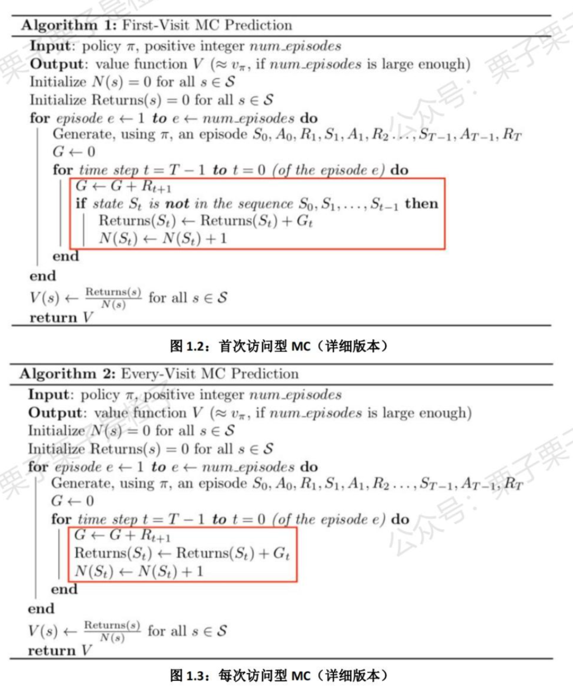
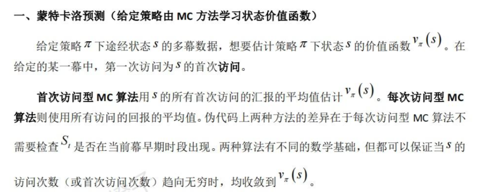
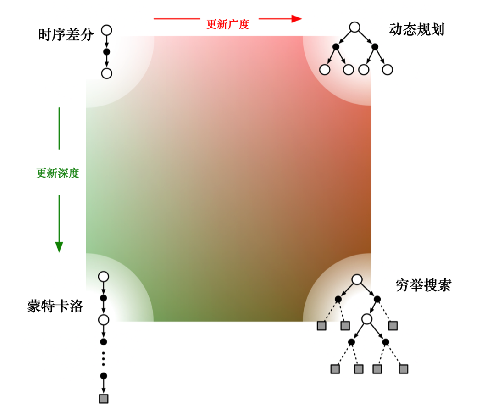

# 有模型与免模型

在上一次的学习中，我们知道强化学习中，需要环境对智能体进行reward，然后智能体再进行对应的action。在真实情况中，环境是显示的，例如遥控小车时遇到的障碍物，但在我们写代码的过程中，我们并不能得到真实的环境是怎样的。因此有两种做法:

1. 有模型。我们通过一系列的函数，把环境给拟合出来，然后把这个环境放到代码里面去训练
2. 免环境：我们通过环境的反馈，让智能体进行一个改进

在模型未知或者模型很大的情况下，我们就会选择免环境的策略，接下来介绍几种免环境的简单方法

# 免模型预测

先明确一下在这里我们研究如何在免模型的情况下预测策略的价值

对于一个给定的策略$\pi$，我们可以得到很多轨迹，每个轨迹对应得到的回报是

$G_t=r_{t+1}+\gamma r_{t+2}+\gamma^2r_{t+3}+\ldots $

此时策略的期望价值是

$V_\pi(s)=\mathbb{E}_{\tau\sim\pi}\left[G_t\mid s_t=s\right]$

# 蒙特卡洛

所谓蒙特卡洛，就是疯狂做实验，用实验的结果去猜测实际情况

其中分为两种方法：每次访问MC方法和首次访问MC

每次访问MC方法和首次访问MC方法是相似的，但前者返回首次访问$S_t$ 后的平均回报率，而后者返回每次访问$S_t$后的平均回报率。

而对于两者的优缺点：

# 时序差分

蒙特卡洛法要求状态是有限的，但实际情况并不是这样的

因此我们引入时序差分，算法比较简单，在蒙特卡洛中，将算法更改一下就行

$V(s_t)\leftarrow V(s_t)+\alpha[r_t+\gamma V(s_{t+1})-V(s_t)]$

# 差别

在实际使用中，实际上这些算法都是写好了的，调库就行，但我们需要这几种算法的好处和有点

接下来，进一步比较时序差分方法和蒙特卡洛方法。

（1）时序差分方法可以在线学习（online learning），每走一步就可以更新，效率高。蒙特卡洛方法必须等游戏结束时才可以学习。

（2）时序差分方法可以从不完整序列上进行学习。蒙特卡洛方法只能从完整的序列上进行学习。

（3）时序差分方法可以在连续的环境下（没有终止）进行学习。蒙特卡洛方法只能在有终止的情况下学习。

（4）时序差分方法利用了马尔可夫性质，在马尔可夫环境下有更高的学习效率。蒙特卡洛方法没有假设环境具有马尔可夫性质，利用采样的价值来估计某个状态的价值，在不是马尔可夫的环境下更加有效。

